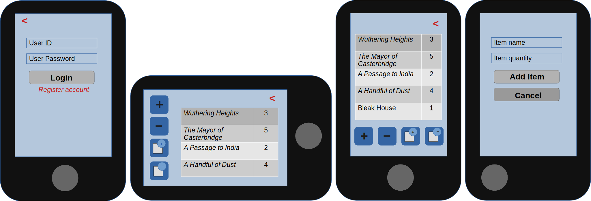
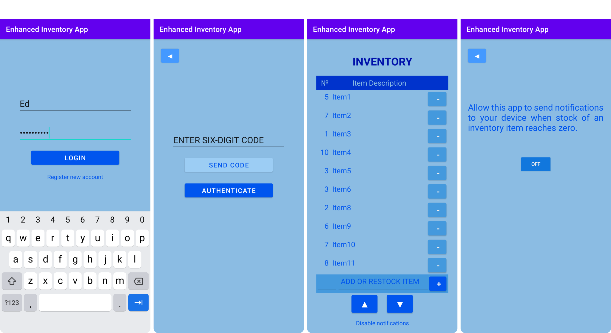

# Inventory Management App for Android

This is an enhancement of an Android inventory management app which I developed as my final project in *CS-360: Mobile Architecture and Programming*.

###### Mockups showing Login Screen, Inventory Screen (landscape and portrait) and Add Item Screen:

I made the following enhancements to the app for my *CS-499: Computer Science Capstone* class:

1. I added two-factor authentication to the login process (requiring that the user input a six-digit one-time passcode texted to their ’phone in addition to their username and password in order to be authenticated);
2. I created a new *activity_authenticate_login* activity to support the above;
3. I added columns to the user data table of the database to include the salt for each user, the randomly-generated passcode and a timestamp for that passcode, as it would expire after three minutes;
4. I incorporated salted and hashed passwords to protect user data even in the event of a data breach.

###### Screenshots from the Emulator showing Login Screen, Authenticate Login Screen, Inventory Screen and Enable Notifications Screen:

